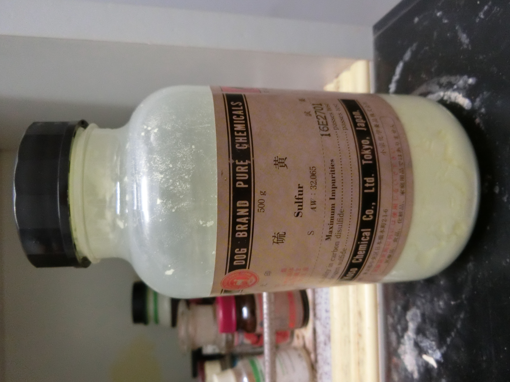
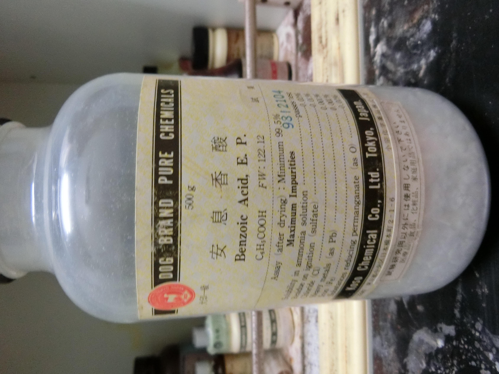
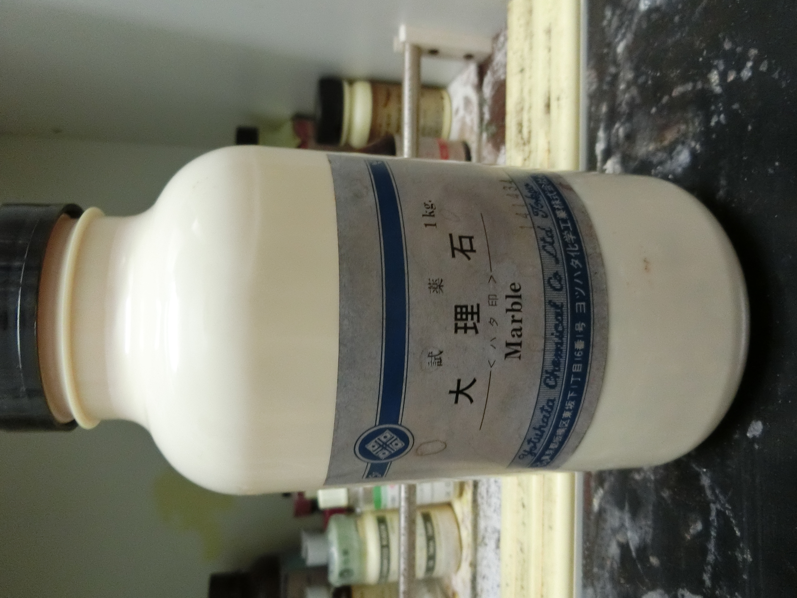
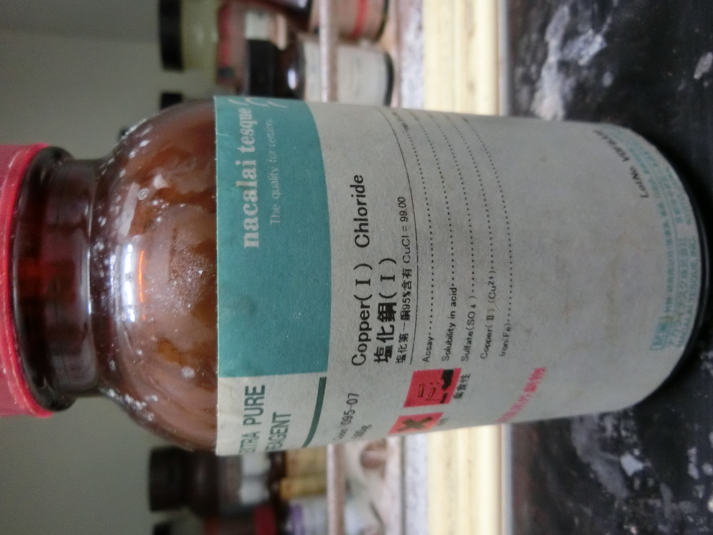
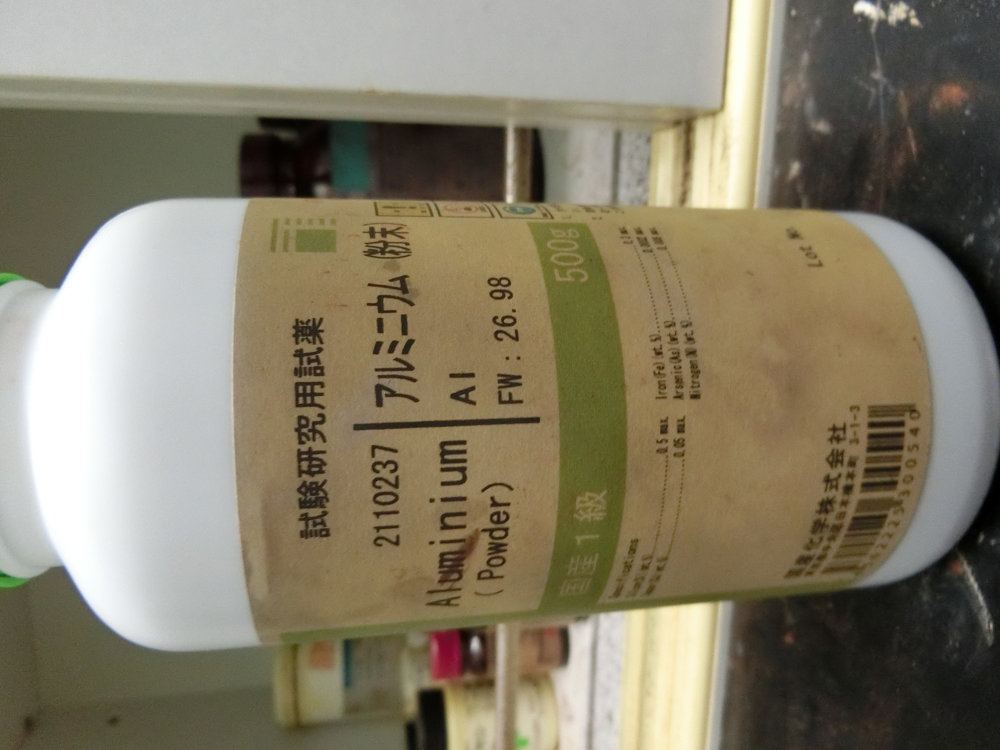
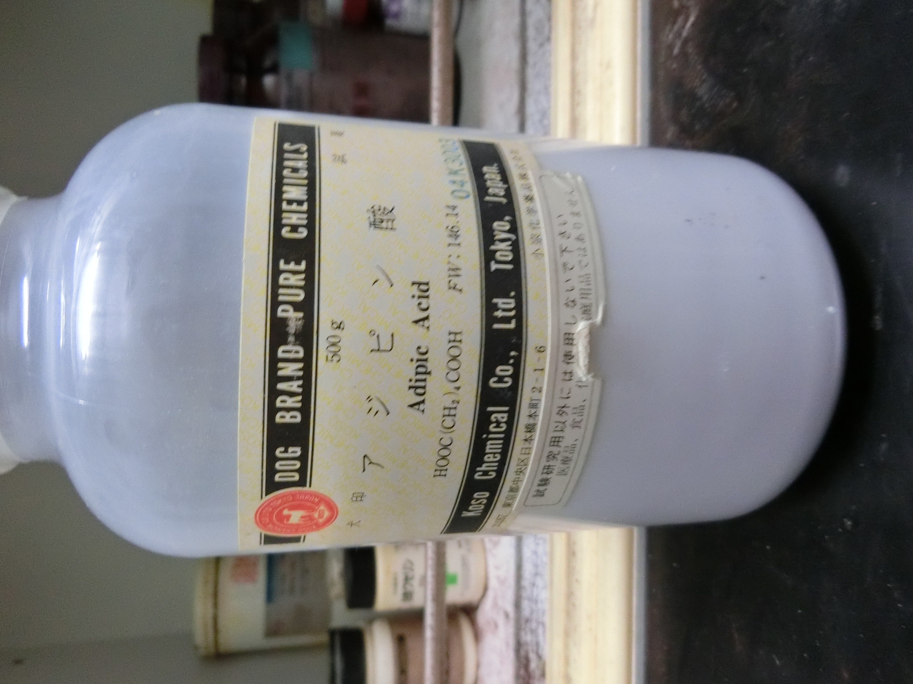
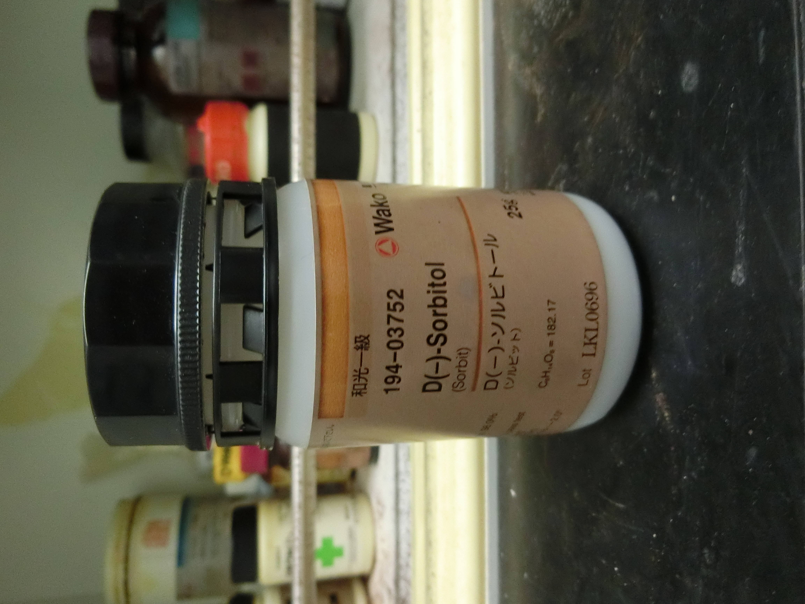
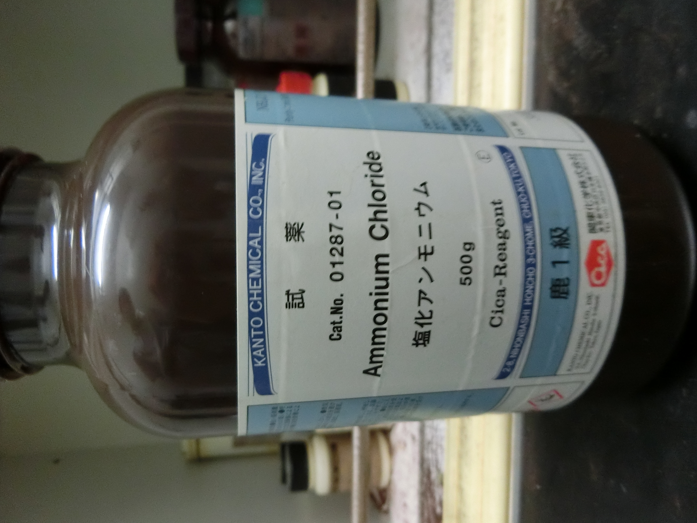

# 主要薬品

- 硫黄

 
- 亜鉛

 
- 水酸化ナトリウム

 
- ヘモグロビン

 
- 臭素

 
- 安息香酸

 
- 酸化マンガン

 
- 大理石

 
- 塩化銅

 
- グルコース

 
- 鉛

 
- 鉄粉

 
- 銅粉末

 
- アルミニウム粉末

 
- 炭酸ナトリウム

 
- アジビン酸

 
- 炭酸水素ナトリウム

 
- 硫酸銅

 
- 硫酸ナトリウム

 
- ソルビトール

 
- シリカゲル

 
- 塩化アンモニウム

 
- 塩化カリウム

