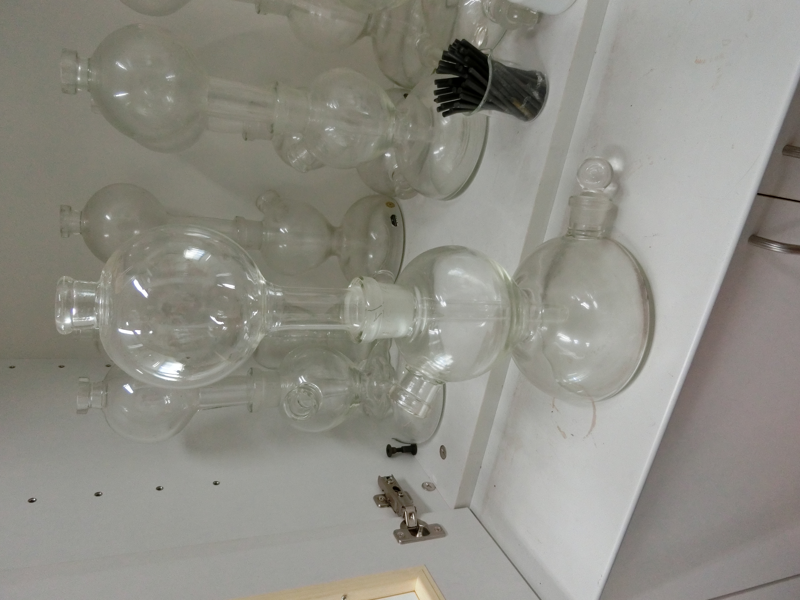
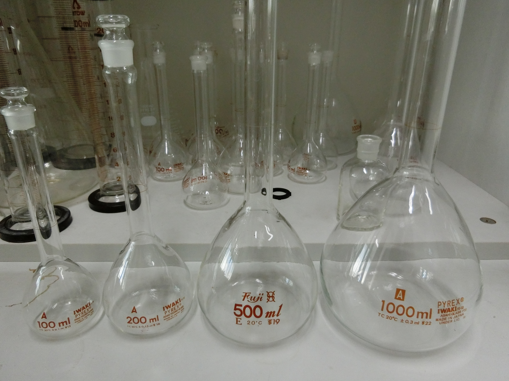
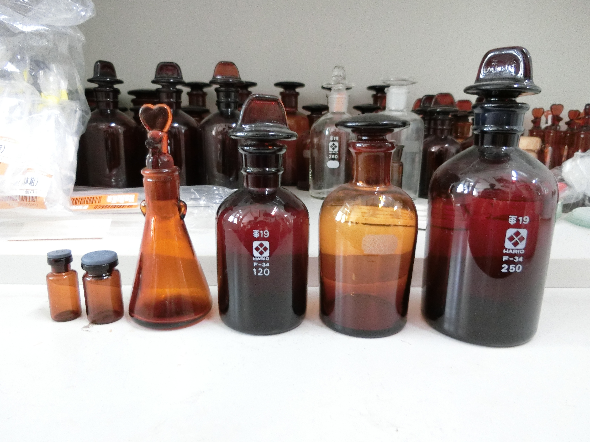
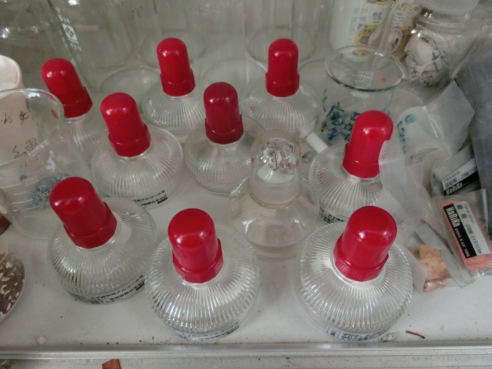
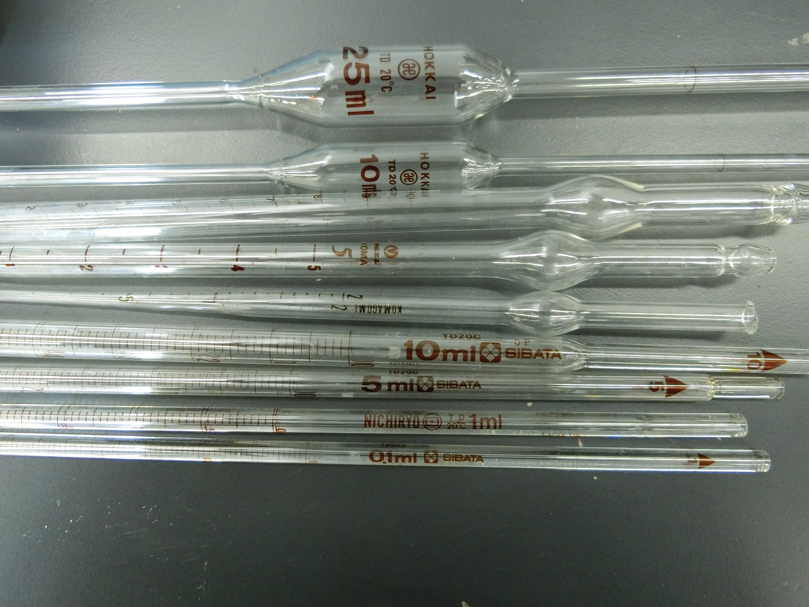
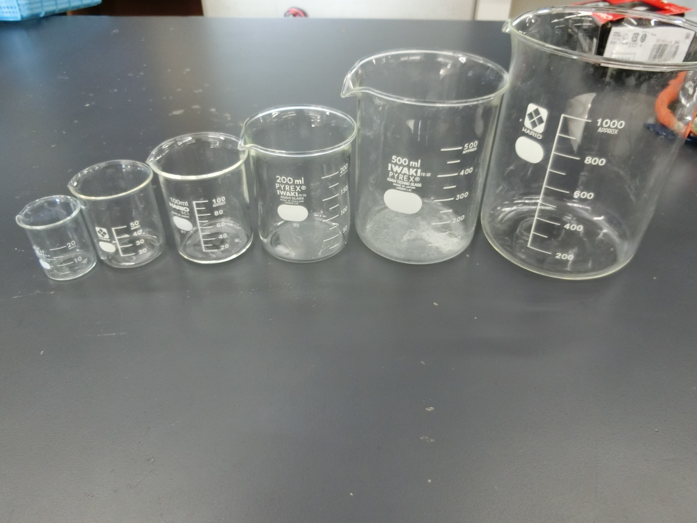
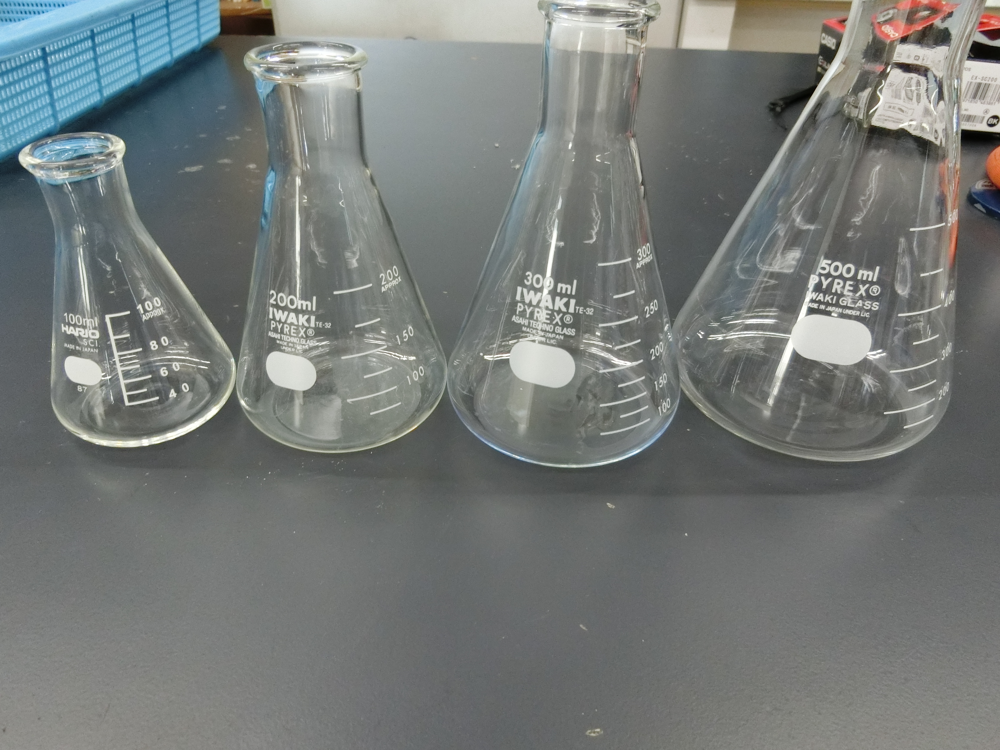
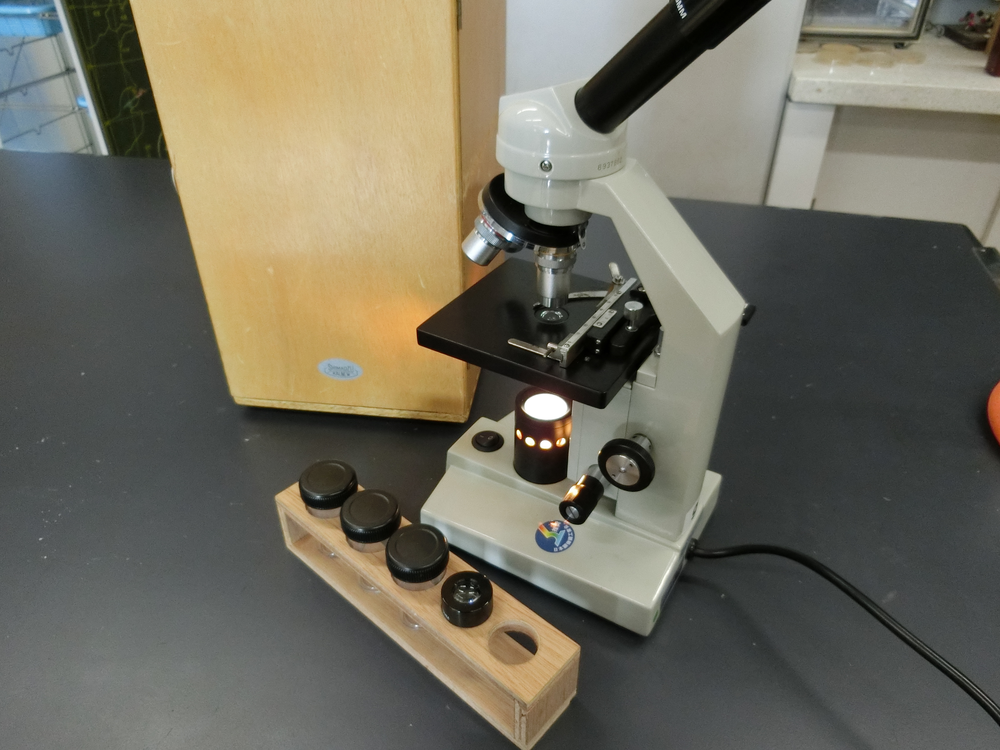

# 主要器具集

## ＜未設定＞  

 
 
## メスフラスコ  

 
 
## メスシリンダー  

 
 
## ＜未設定＞  

 
 
## ＜未設定＞  

 
 
## アルコールランプ  

 
 
## プレパラート  

 
 
## ピペット  

 
 
## ビーカー  

 
 
## 三角フラスコ  

 
 
## コニカルビーカー  

 
 
## ガスバーナー  

 
 
## 丸底フラスコ  

 
 
## 顕微鏡  

 
 
## ビュレット  

 
 
## ＜未設定＞  

 
 
## 蒸留水タンク  

 
 
